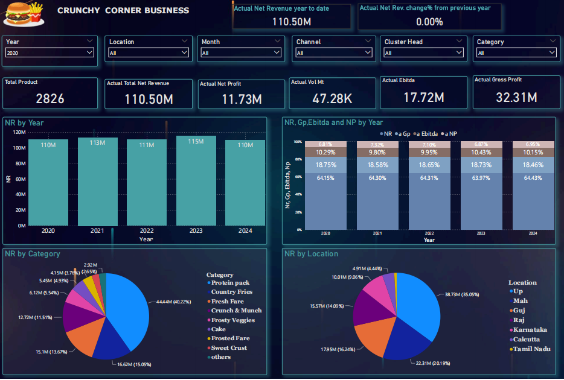
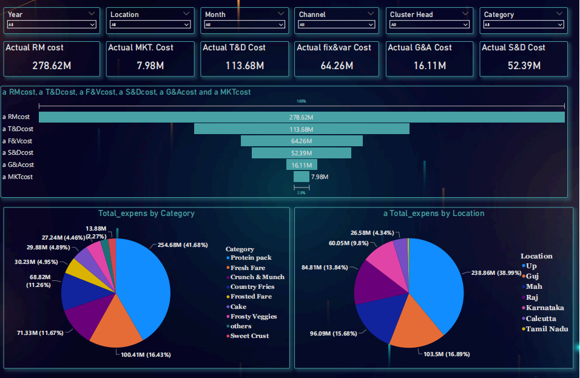
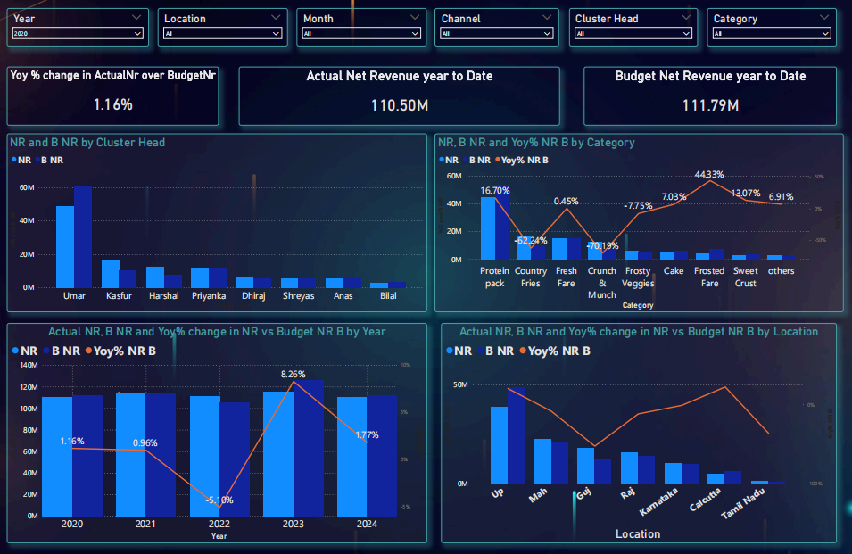

# Crunchy Corner Business Analysis

## Dashboard Preview
Below are key snapshots from the Power BI dashboard.

📥 For full interactive view, download the PDF file from this repository.

## Dashboard Screenshots

### Overview

### Cost & Expense Analysis

### Budget vs Actual

---

## Project Overview
This project analyzes 5 years of business data (Actual vs Budget) to evaluate revenue, cost, and profitability across categories and locations.

## Business Problem
The company needed a clear view of:
- Which categories and regions generate maximum revenue
- Where profit margins are low
- How actual performance compares with budget

## Dataset
- 5 years of data (Actual & Budget)
- Includes revenue, cost, profit, category, and location details
- Data was cleaned and transformed before analysis

## Tools Used
- Power BI
- DAX
- Data Modeling

## Data Preparation
- Cleaned missing and inconsistent values
- Standardized category and date formats
- Merged Actual and Budget datasets
- Created relationships using Date and SKU

## Key KPIs
- Net Revenue (NR)
- Gross Profit (GP)
- EBITDA
- Net Profit (PAT)
- Raw Material Cost %

## Key Insights
- Revenue remained stable around 110–115M
- Protein Pack is the top-performing category
- UP and Maharashtra contribute highest revenue
- RM Cost % is stable around 49–50%
- Some categories show lower GP% and need improvement
- Budget vs Actual comparison shows underperforming regions

## Business Impact
- Helps identify high and low performing categories
- Supports pricing and cost optimization decisions
- Enables tracking of actual vs budget performance

## Files Included
- Dashboard PDF

## Author
Akash
